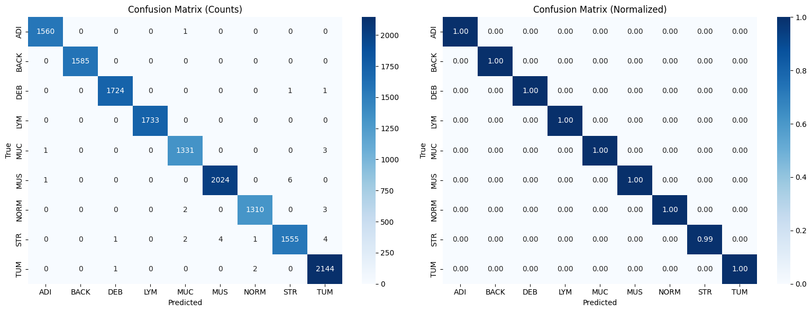

# H&E Histopathology Tissue Classification with Explainable AI

**Multi-class classification of colorectal cancer tissue from H&E stained microscopy images**


## Project Overview

This project demonstrates an end-to-end deep learning pipeline for classifying tissue types from H&E (Hematoxylin & Eosin) stained histopathology images. The experiment evaluates colorectal tissue patches. Transfer to another tissue type or age group requires separate data and evaluation.

### Key Features
- 9-class tissue classification (tumor, stroma, lymphocytes, etc.)
- Transfer learning with EfficientNet-B0
- GradCAM explainability for clinical interpretability
- Comprehensive evaluation with confusion matrices and per-class metrics

## Results

| Metric | Value |
|--------|-------|
| Test Accuracy | **99.77%** |
| Quadratic Weighted Kappa | **0.9985** |
| Tumor Detection AUC | **1.0000** |
| Tumor Precision | 99.49% |
| Tumor Recall (Sensitivity) | 99.86% |
| Tumor F1 Score | 0.9967 |

### Per-Class Performance

| Clinical Group | Class | Accuracy |
|----------------|-------|----------|
| Tumor-related | TUM (Tumor) | 99.9% |
| Tumor-related | STR (Stroma) | 99.2% |
| Immune | LYM (Lymphocytes) | 100.0% |
| Normal tissue | NORM (Normal mucosa) | 99.6% |
| Normal tissue | MUS (Smooth muscle) | 99.7% |
| Normal tissue | ADI (Adipose) | 99.9% |
| Other | MUC (Mucus) | 99.7% |
| Other | DEB (Debris) | 99.9% |
| Other | BACK (Background) | 100.0% |

## Dataset

**NCT-CRC-HE-100K**: 100,000 H&E stained image patches from colorectal cancer tissue

### Download

- **Kaggle**: [kaggle.com/datasets/imrankhan77/nct-crc-he-100k](https://www.kaggle.com/datasets/imrankhan77/nct-crc-he-100k)
- **Zenodo** (Original): [zenodo.org/records/1214456](https://zenodo.org/records/1214456)

### Tissue Classes

| Class | Description | Clinical Relevance |
|-------|-------------|-------------------|
| **TUM** | Colorectal adenocarcinoma epithelium | Primary tumor tissue |
| **STR** | Cancer-associated stroma | Tumor microenvironment |
| **LYM** | Lymphocytes | Immune infiltration |
| **MUC** | Mucus | Mucinous differentiation |
| **MUS** | Smooth muscle | Normal tissue boundary |
| **NORM** | Normal colon mucosa | Healthy tissue |
| **ADI** | Adipose tissue | Fat tissue |
| **DEB** | Debris | Processing artifacts |
| **BACK** | Background | Non-tissue regions |

## Quick Start

### Run on Kaggle

1. Go to the [NCT-CRC-HE-100K dataset](https://www.kaggle.com/datasets/imrankhan77/nct-crc-he-100k)
2. Click **"New Notebook"**
3. Upload the notebook or copy the code
4. Enable **GPU**: Settings → Accelerator → GPU P100
5. Run all cells

### Run Locally

```bash
# Clone repository
git clone https://github.com/Joana-Mansa/HnE_tissue_classification.git
cd HnE_tissue_classification

# Install dependencies
pip install torch torchvision numpy pandas matplotlib seaborn scikit-learn opencv-python tqdm pillow

# Download dataset and update DATA_DIR path in notebook
# Run notebook
jupyter notebook h-e-tissue-classification.ipynb
```

## Project Structure

```
h-e-tissue-classification.ipynb  Main notebook
requirements.txt               Python dependencies
docs/                          Historical figures and methodology
README.md                      Project overview
```

Model/checkpoint files are generated by the notebook and are not committed. Set `HE_DATA_DIR` to your extracted dataset folder for a local run. The extensionless duplicate was removed after confirming its source cells match the named notebook.


## Model Architecture

- **Backbone**: EfficientNet-B0 (pretrained on ImageNet)
- **Classifier**: Custom head with dropout regularization
- **Input size**: 224 x 224 pixels
- **Training**: 15 epochs with AdamW optimizer and learning rate scheduling

## Explainability

GradCAM (Gradient-weighted Class Activation Mapping) visualizations show which regions of the tissue image the model focuses on for classification decisions. This is crucial for:

- **Clinical trust**: Pathologists can verify the model attends to relevant morphological features
- **Model validation**: Ensuring predictions are based on biologically meaningful patterns
- **Deployment readiness**: Meeting interpretability requirements for clinical AI systems

## Evaluation scope

The reported metrics come from the original notebook’s random, stratified **patch-level** split. They do not establish patient/slide independence or performance on a new hospital cohort. The figures below were exported from the saved historical outputs; no full training rerun was performed during maintenance.



[Data, split and reproducibility notes](docs/methodology.md)

## Requirements

```
torch>=2.0.0
torchvision>=0.15.0
numpy>=1.21.0
pandas>=1.3.0
matplotlib>=3.4.0
seaborn>=0.11.0
scikit-learn>=1.0.0
opencv-python>=4.5.0
tqdm>=4.62.0
Pillow>=8.0.0
```

## References

1. Kather, J.N., et al. (2019). Predicting survival from colorectal cancer histology slides using deep learning. *PLOS Medicine*.
2. Tan, M. & Le, Q. (2019). EfficientNet: Rethinking Model Scaling for CNNs. *ICML*.
3. Selvaraju, R.R., et al. (2017). Grad-CAM: Visual Explanations from Deep Networks via Gradient-based Localization. *ICCV*.

## Author

**Joana Owusu-Appiah**  
MSc Medical Imaging and Applications (Erasmus Mundus)  
Email: owusuappiahjoana59@gmail.com  
[LinkedIn](https://www.linkedin.com/in/joana-owusu-appiah-msc-8751a9166/) | [GitHub](https://github.com/Joana-Mansa)

---
